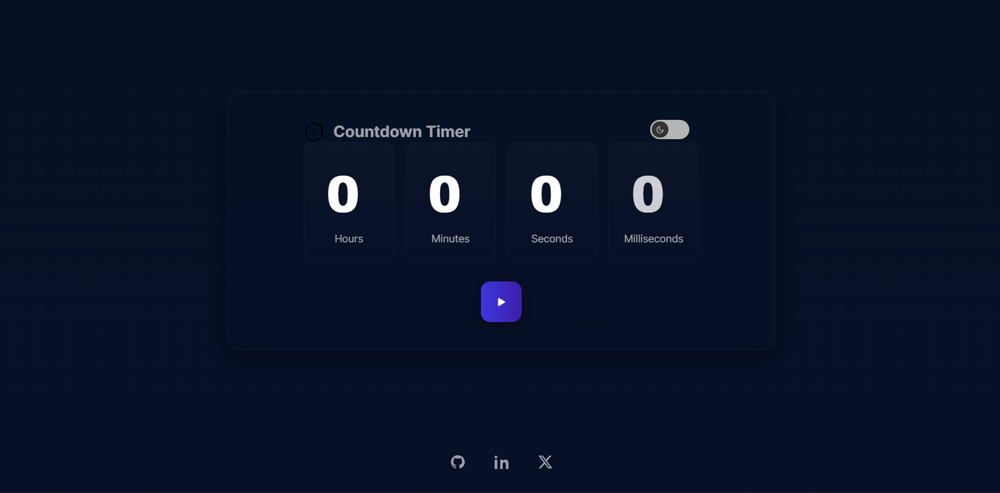

# Count-down-timer-react

A minimal, responsive countdown timer built with React. The app supports dark and light themes, allows you to set a countdown, and includes a bottom-center footer with social icons (GitHub, LinkedIn, and X).

---

**Preview**

UI with theme toggle and footer social icons:




---

**Features**
- Responsive, accessible countdown timer
- Toggle between light and dark themes with state persisted to localStorage
- Fully functional footer with social links for GitHub, LinkedIn, and X
- Small, dependency-light React app

---

**Tech Stack**
- React 16
- Minimal CSS (no CSS frameworks)

---

**Getting Started**

Prerequisites:
- Node.js (v14+ recommended)
- npm (comes with Node.js)

Install dependencies:

```bash
npm install
```

Development server (Windows):

```bash
npm start
```

Notes:
- The `start` script sets an environment variable using Windows syntax. On macOS/Linux, you can run the script as:

```bash
NODE_OPTIONS=--openssl-legacy-provider npm start
```

---

**Usage**
- Open the app in your browser (usually http://localhost:3000)
- Set hours/minutes/seconds, press start, pause, or reset
- Toggle the theme using the sun/moon toggle in the header
- Social icons in the footer open in a new tab and link to the configured profiles

---

**File Structure**
- `src/components/` - React components
	- `App.jsx` - Root component and renderer
	- `CountdownTimer.jsx` - Timer UI + logic
	- `Footer.jsx` - Footer component with social icons
	- `icons/` - SVG icon components (GithubIcon, LinkedinIcon, XIcon, SunIcon, MoonIcon)
- `src/styles.css` - Global styles and theming
- `src/assets/images/` - svg icon assets

---

**Contributing**
Contributions are welcome. Open an issue or submit a pull request with a clear description of the change and tests/visuals if applicable.

**License**
This project is open-source and free to use. Add your preferred license if you want to publish it publicly.

**Maintainer**
Fiyinfoluwa Osokoya

